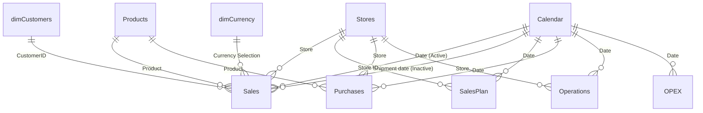

# Архитектура семантической модели Yess-PP

Семантическая модель отчета `Yess-PP` спроектирована по канонической реляционной схеме **«Звезда» (Star Schema)** с выделением таблиц фактов, справочников измерений и расчетных таблиц.

---

## 1. Диаграмма модели (Star Schema)

---

## 2. Назначение таблиц

### Таблицы измерений (Dimensions)
* **`Calendar`** — вычисляемый календарь (Time Intelligence) с непрерывным диапазоном дат с 2016 по 2020 год. Содержит атрибуты года, квартала, месяца, дня недели и курса тенге (`KZT`).
* **`dimCustomers`** — справочник клиентов: пол, контакты, дата рождения, возрастные группы.
* **`Products`** — справочник товаров: бренд, категория, подкатегория, производитель, цвет, вес.
* **`Stores`** — справочник магазинов: адрес, город, торговая площадь, количество касс, дата открытия.
* **`dimCurrency`** — справочник валют (`$`, `KZT`) для динамического пересчета.

### Таблицы фактов (Facts)
* **`Sales`** — продажи товаров в рознице (чеки, цены, количество, себестоимость).
* **`SalesPlan`** — плановые показатели продаж в разрезе магазинов и дат.
* **`Purchases`** — закупки и перемещения товаров.
* **`Operations`** — операционные расходы магазинов (факт и план).
* **`OPEX`** — общие операционные расходы компании по категориям.

### Специализированные таблицы вычислений
* **`MeasureTable`** — таблица хранения мер товарных остатков на складах и накопительных итогов.
